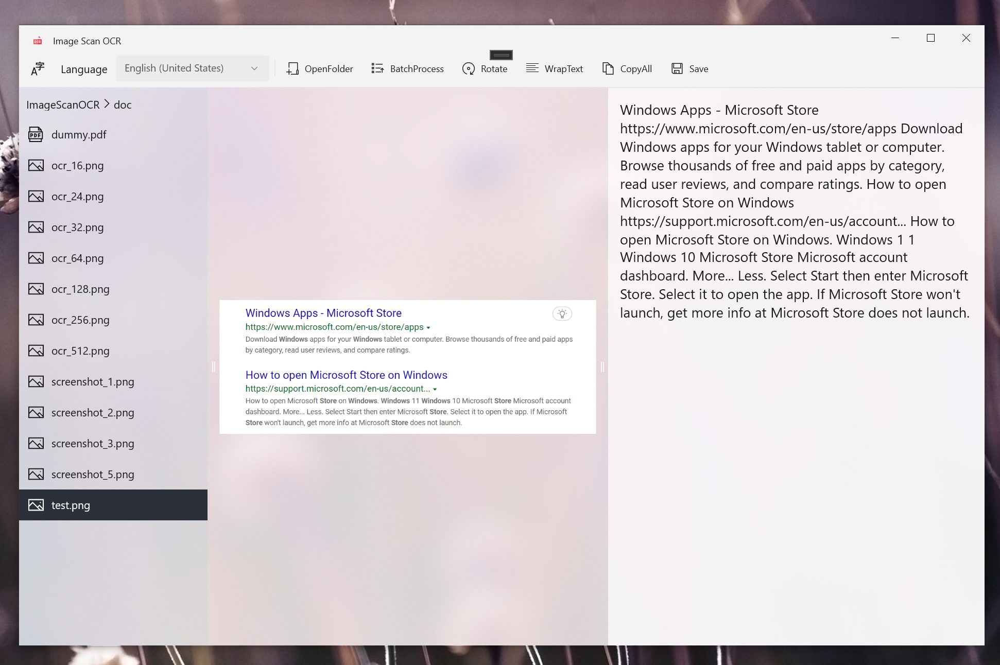
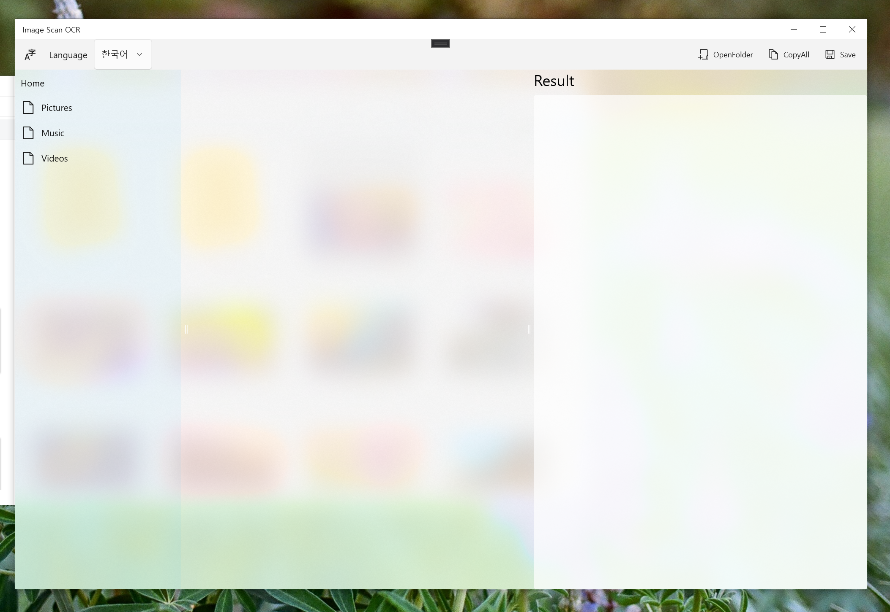
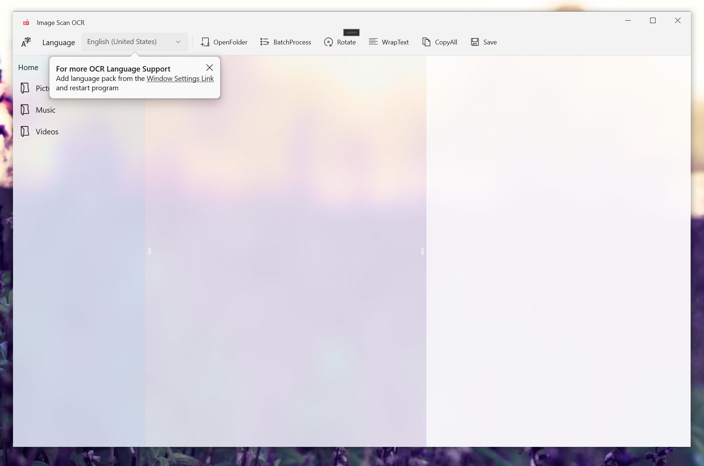

# ImageScanOCR
Image Scan OCR recognize text from image and PDF using Window OCR.  
This OCR app convert given text image to editable plain text.   
User can handle its plain text and can save OCR result text as plain text file.  
download from [microsoft store](https://www.microsoft.com/en-us/p/image-scan-ocr/9pjhnq2r5kg7?activetab=pivot:overviewtab)     

# Result   
    
    
    

# Features   
- Convert image to editable text
- PDF file can be opened to process OCR
- User can edit OCR result text and save text as file
- OCR result text can be copied into user clipboard
- Uses Window OCR API to support offline OCR process
- Support multiple OCR language when Window language pack installed
- User can select folder to search OCR required file
- Process all image once using batch OCR processing
- Rotate image to process OCR correctly
- User can vary OCR text result display mode
- Able to see sentence splitted OCR text result

# Required environment to run    
- [winui2-getting-started](https://docs.microsoft.com/en-us/windows/apps/winui/winui2/getting-started)     
  - https://www.nuget.org/packages/Microsoft.UI.Xaml
- [communitytoolkit-getting-started](https://docs.microsoft.com/en-us/windows/communitytoolkit/getting-started)    
  - https://www.nuget.org/packages/Microsoft.Toolkit.Uwp.UI.Controls/

# Privacy policy
- Image Scan OCR uses user data only for Window OCR process purpose.
- It does not share any user data with any other third parties.
- It does not store any personal data, images, or OCR result text

# Change log
- 1.0.6 - 1.0.3
  - Apply WinUI Mica
  - Add tooltip to alert OCR language pack install  
  - Support batch OCR processing  
  - Support OCR on pdf  
  - Reopen previous opened folder  
  - Support rotation on OCR image  
  - Support text wrap on OCR result text  
  - Support OCR result text to split by sentence
- 1.0.2  
  - First release 

# Acknowledgement and References  
- [winui2-getting-started](https://docs.microsoft.com/en-us/windows/apps/winui/winui2/getting-started)     
- [communitytoolkit-getting-started](https://docs.microsoft.com/en-us/windows/apps/winui/winui2/getting-started)    
- [window-ocr-kaki104](https://kaki104.tistory.com/491)     
- [window-ocr-rkttu](https://velog.io/@rkttu/csharp-win10-ocr-howto)     
- [Windows-universal-samples-ocr](https://github.com/microsoft/windows-universal-samples/tree/main/Samples/OCR)     
- [acrylic](https://docs.microsoft.com/ko-kr/windows/apps/design/style/acrylic)     
- [gridsplitter](https://docs.microsoft.com/en-us/windows/communitytoolkit/controls/gridsplitter)     
- [breadcrumbbar](https://docs.microsoft.com/ko-kr/windows/apps/design/controls/breadcrumbbar)     
- [file-access-permissions](https://docs.microsoft.com/en-us/windows/uwp/files/file-access-permissions)
- [window-store-deploy](https://codedragon.tistory.com/3209)
- [ocr_icon](https://www.flaticon.com/premium-icon/ocr_5558190)
- [stop-task-when-task-run](https://stackoverflow.com/questions/36911609/stop-task-when-task-run)   
- [BarcodeScanner](https://github.com/kiwamu25/BarcodeScanner/blob/f5359693019ea957813b364b456bba571f881060/BarcodeScanner/BarcodeScanner/MainPage.xaml.cs)   
- [displaying-pdf-files-in-a-uwp-app](https://blog.pieeatingninjas.be/2016/02/06/displaying-pdf-files-in-a-uwp-app/)   
- [open-pdf-in-uwp](https://pspdfkit.com/blog/2019/open-pdf-in-uwp/)   
- [flyouts/teaching-tip](https://docs.microsoft.com/ko-kr/windows/apps/design/controls/dialogs-and-flyouts/teaching-tip)   
- [launch-settings-app](https://docs.microsoft.com/en-us/windows/uwp/launch-resume/launch-settings-app)   
- [how-to-access-files-or-folders](https://stackoverflow.com/questions/52227435/how-to-access-files-or-folders-the-user-picked-in-a-previous-session-of-my-uwp-a)   
- [segoe-ui-symbol-font](https://docs.microsoft.com/en-us/windows/apps/design/style/segoe-ui-symbol-font)   
- [mica](https://docs.microsoft.com/en-us/windows/apps/design/style/mica)   
- [Rise-Notes](https://github.com/Rise-Software/Rise-Notes)   
- [window store delploy](https://codedragon.tistory.com/3209) 

