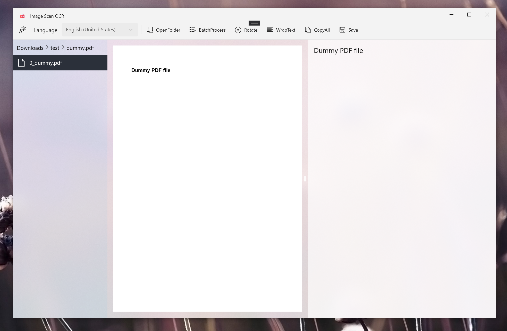

# ImageScanOCR
Image to text using window OCR

# Result   
    
     

# Features   
- image to show text
- allow to make text
- file list
  
# Required environment to run    
https://www.nuget.org/packages/Microsoft.Toolkit.Uwp.UI.Controls/
https://www.nuget.org/packages/Microsoft.UI.Xaml

# Privacy policy
- ImageScanOCR uses user data only for OCR purpose using window OCR.   
- It does not share any user data with any other third parties.   

# Acknowledgement and References  

- [winui2-getting-started](https://docs.microsoft.com/en-us/windows/apps/winui/winui2/getting-started)     
